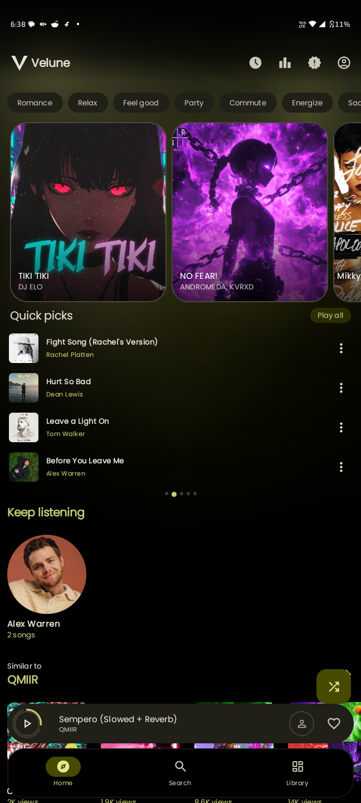
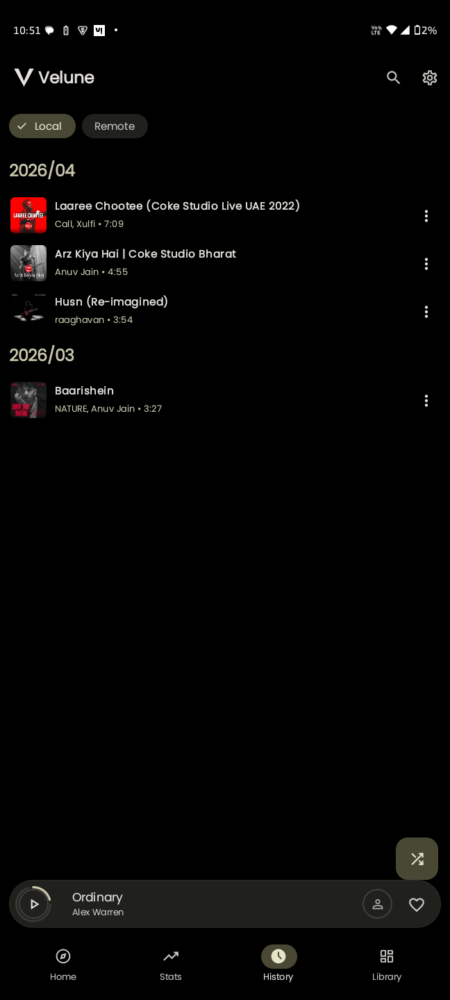
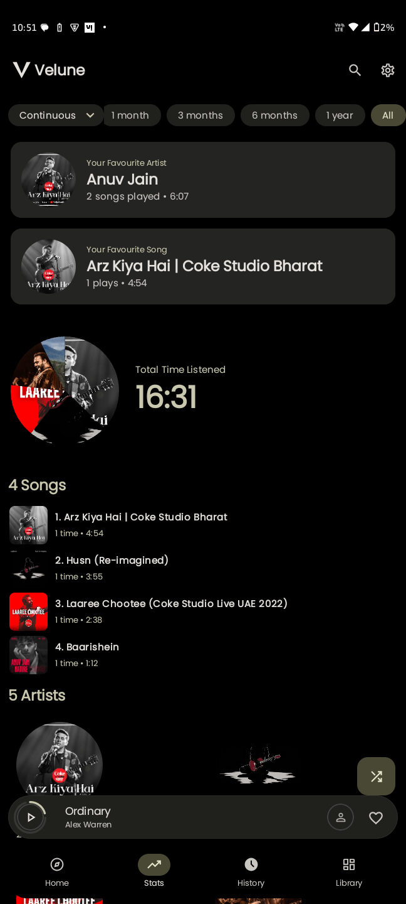
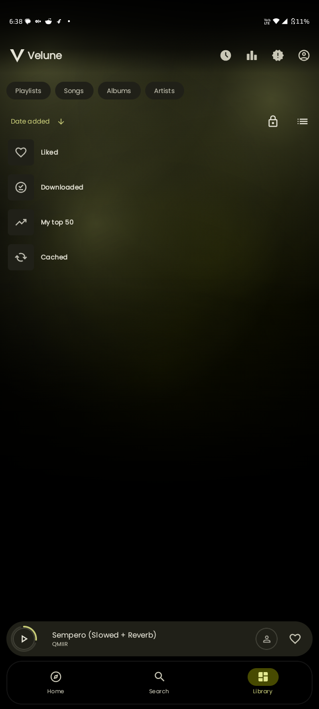
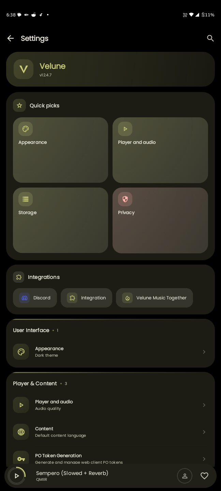
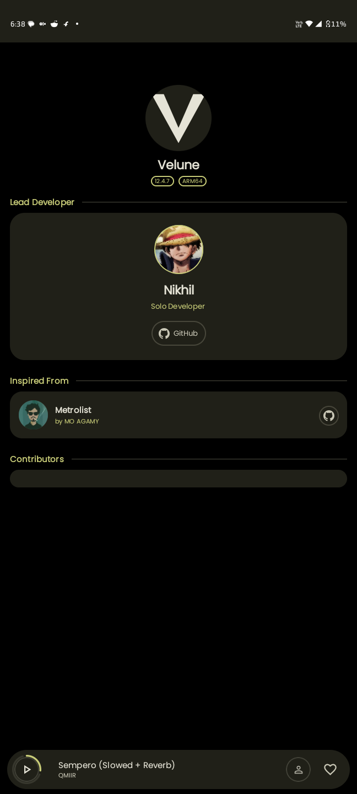

<div align="center">


</div>

# 🎵 Echofy

<div align="center">

### 🎧 The YouTube Music app you always wanted

🚫 No Ads • 💰 No Subscription • ⚡ Full Control


<br>


</div>

---

## 📥 Download Now

<div align="center">

| GitHub Releases | Obtainium |
| :---: | :---: |
| <a href="https://github.com/Vidya-Inc/Echofy-Android/releases/latest"></a> | <a href="https://apps.obtainium.imranr.dev/redirect?r=obtainium://add/https://github.com/Vidya-Inc/Echofy-Android"></a> |

</div>

---

## 🚀 Why Echofy?

Echofy is not just another music player — it's a **complete reimagination of YouTube Music**.

* ⚡ **Faster** than the official app
* 🎵 Built for audiophiles & power users
* 📦 True offline-first experience
* 🎨 Stunning **Material You** interface

> 💡 This is YouTube Music — *but unlocked*

---

## 🎯 Highlight Feature

### 🎤 Real-Time Synced Lyrics

Experience lyrics like never before:

- Word-by-word sync
- Smooth animations
- Translation support
- Fully immersive playback

---

## 📸 Preview

<div align="center">






<br/>





</div>

---

## ✨ Features

### 🎵 Core Experience
- Ad-Free Playback
- Full Library Sync
- Offline Caching (Encrypted)
- Background Playback

### 🔊 Audio Engine
- Gapless Playback
- Crossfade Engine
- Silence Skipping
- Loudness Normalization (EBU R128)
- Tempo & Pitch Control
- System EQ Integration

### 🎨 UI & Discovery
- Material You (Dynamic Colors)
- Synced Lyrics + Translation
- Discord Rich Presence
- Personalized Home Feed
- Year in Review Stats
- Custom Animated Loader
- Home Screen Widget

---

## 🧠 Architecture

Built using **modern Android engineering principles**:

- MVVM + Clean Architecture
- Unidirectional Data Flow (UDF)
- Modular & scalable codebase

---

## 🛠 Tech Stack

| Layer | Stack |
|------|------|
| Language | Kotlin |
| UI | Jetpack Compose + Material 3 |
| Audio | Media3 / ExoPlayer |
| DI | Hilt |
| Database | Room (Encrypted) |
| Networking | Ktor + Retrofit |
| Async | Coroutines + Flow |
| Build | Gradle KTS |

---

## 📂 Project Structure

```bash
Echofy-Android/
├── app/
├── innertube/
├── lrclib/
├── kizzy/
├── canvas/
├── lastfm/
├── kugou/
├── betterlyrics/
└── simpmusic/
```

## 🏁 Getting Started

**Requirements**
- Android Studio Ladybug+
- JDK 21
- Android SDK 36+

**Run locally**
```bash
git clone https://github.com/Vidya-Inc/Echofy-Android.git
cd Echofy-Android
```
Open in Android Studio → Sync → Run ▶

---

## 💬 Community

Have a feature request, found a bug, or just want to share your favorite music setups?

* *GitHub Issues:* [Report a Bug](https://github.com/Vidya-Inc/Echofy-Android/issues)
* *GitHub Discussions:* [Open a Discussion](https://github.com/Vidya-Inc/Echofy-Android/discussions)

---

## 🙌 Credits

Huge respect to these projects:

- **Archivetune** — base framework
- **Metrolist**
- **InnerTune**
- **Kizzy**
- **SimpMusic**
- **BetterLyrics**

## ⚖️ Legal

Echofy is an independent client and is not affiliated with YouTube or Google.
Please support artists through official platforms ❤️
Licensed under **GPL-3.0** — see the [LICENSE](LICENSE) file for details.

---

💙 Built with passion by **Vidya-Inc** ([@Vidya-Inc](https://github.com/Vidya-Inc)) — the team behind [VIDYA](https://github.com/Vidya-Inc/vidya-frontend)
⭐ Star the repo if Echofy impressed you
🚀 Help it reach more people
